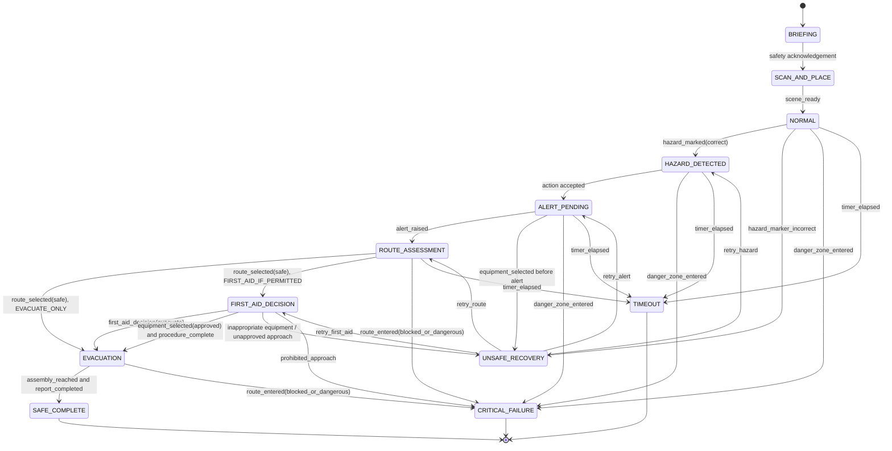

# Fire & Explosion Response — Formal Scenario and Competency Specification

> **Status:** design specification for the next implementation stage.
>
> **Safety boundary:** This specification is a training-engine model, not an emergency procedure. The named safety officer and site SOP owner must configure and approve every allowed response, critical failure, timing threshold, and feedback message before it is deployed to workers.

## 1. Why this module is a state machine

The module must assess *what a worker demonstrated*, not whether they tapped their way through a fixed tutorial. A state machine makes every action explicit, explainable, measurable, and reviewable.

```text
approved SOP → reviewed scenario graph → AR interaction events
             → deterministic assessment → competency vector
             → targeted remediation → fresh scenario → retest
```

The AR engine renders the scene. The rules engine decides whether an action is allowed, unsafe, incomplete, or critical. The competency engine records the result. An LLM, if used for content authoring, never decides an operational procedure, final result, or certificate validity.

## 2. Scope and guardrails

This fire module evaluates five observable competencies:

1. **Hazard recognition** — recognize the simulated fire/smoke and mark the hazard boundary.
2. **Initial response prioritization** — select the SOP-approved first response, such as raising an alarm.
3. **Safe route selection** — identify a viable exit/muster direction without crossing the danger zone.
4. **Conditional first-aid response** — where the approved scenario permits it, select suitable equipment and preserve an escape route.
5. **Evacuation and reporting** — move to a safe point and complete the configured report/assembly action.

It must not teach a universal “always fight a fire” rule. Each scenario selects one of these site-approved policies:

| Policy | Allowed learning path |
| --- | --- |
| `EVACUATE_ONLY` | Alarm/alert → safe route → evacuate → assembly/report. |
| `FIRST_AID_IF_PERMITTED` | Alarm/alert → evaluate conditions → use approved extinguisher only if scenario conditions permit → safe route → evacuate/report. |
| `OBSERVE_AND_ESCALATE` | Identify/alert → maintain boundary → communicate/escalate; no approach or intervention. |

## 3. Shared data vocabulary

### States

| State | Meaning |
| --- | --- |
| `BRIEFING` | Worker sees the simulation disclaimer and task objective. |
| `SCAN_AND_PLACE` | AR scans/anchors the scene, or chooses a fallback layout. |
| `NORMAL` | Scene is ready; no learning prompt acted on yet. |
| `HAZARD_DETECTED` | The worker has acknowledged/identified the simulated hazard. |
| `ALERT_PENDING` | Hazard has been detected; approved alert/escalation still required. |
| `ROUTE_ASSESSMENT` | Worker must select a safe route under current hazard geometry. |
| `FIRST_AID_DECISION` | Optional policy branch; worker evaluates whether an intervention is permitted. |
| `EVACUATION` | Worker follows an approved safe route to the assembly/report point. |
| `SAFE_COMPLETE` | All mandatory objectives are complete without a critical failure. |
| `UNSAFE_RECOVERY` | A non-critical unsafe action occurred; consequence shown and retry path assigned. |
| `CRITICAL_FAILURE` | A prohibited/high-risk action occurred; attempt fails and retraining is required. |
| `TIMEOUT` | Required safe decision was not made within the scenario threshold. |

### Events emitted by the AR client

```text
scene_ready
hazard_marked
hazard_marker_incorrect
alert_raised
route_selected
route_entered
equipment_inspected
equipment_selected
first_aid_decision
danger_zone_entered
assembly_reached
report_completed
hint_requested
timer_elapsed
app_paused
```

Every event contains: `attempt_id`, sequence number, scenario/content version, server-independent timestamp, AR/fallback mode, action target, and optional spatial evidence (`anchor_id`, zone ID, approximate pose). No camera recording is required by default.

## 4. Scenario graph



## 5. Transition table: expected actions and safety meaning

| From | Worker action | Condition | To | Rules-engine result | Competency impact |
| --- | --- | --- | --- | --- | --- |
| `NORMAL` | Mark hazard | Marker overlaps approved hazard area | `HAZARD_DETECTED` | Correct | + hazard recognition |
| `NORMAL` | Mark hazard | Marker outside tolerance | `UNSAFE_RECOVERY` | Incorrect perception; show corrected boundary | Record recognition miss |
| `HAZARD_DETECTED` | Raise alarm/alert | Correct control selected | `ALERT_PENDING` then `ROUTE_ASSESSMENT` | Correct | + response prioritization |
| `HAZARD_DETECTED` | Touch extinguisher | Policy requires alert first | `UNSAFE_RECOVERY` | Unsafe sequence, not necessarily critical | Deduct sequence; target remediation |
| `ROUTE_ASSESSMENT` | Select safe exit | Route does not cross blocked/danger zone | `EVACUATION` or `FIRST_AID_DECISION` | Correct | + safe route selection |
| `ROUTE_ASSESSMENT` | Select blocked exit | Route intersects active danger zone | `CRITICAL_FAILURE` | Critical unsafe route | Critical failure + route deficit |
| `FIRST_AID_DECISION` | Choose evacuation | Any time conditions do not permit intervention | `EVACUATION` | Correct conservative choice | + response decision |
| `FIRST_AID_DECISION` | Choose equipment | Equipment and conditions match approved SOP | `EVACUATION` after configured interaction | Correct conditional action | + equipment selection + sequence |
| `FIRST_AID_DECISION` | Choose inappropriate equipment | Mismatch in class/condition | `UNSAFE_RECOVERY` or `CRITICAL_FAILURE` per SOP | Unsafe response | Record equipment selection deficit |
| Any pre-safe state | Enter danger zone | Position crosses forbidden polygon | `CRITICAL_FAILURE` | Stop attempt and show consequence | Critical unsafe action |
| `EVACUATION` | Reach assembly and report | Required actions complete | `SAFE_COMPLETE` | Assessment complete | + evacuation/reporting |

The state names are intentionally domain-neutral enough to power the Gas module later. Only the scenario configuration, zones, actions, policy, competency definitions, and feedback change.

## 6. Consequence design

An unsafe decision must create an understandable, safe simulation consequence rather than only a red cross.

| Unsafe action | Visual/audio consequence | Feedback intent | Attempt disposition |
| --- | --- | --- | --- |
| Incorrect hazard boundary | The correct risk boundary appears, with narration. | Teach spatial recognition. | Retry allowed. |
| Extinguisher selected before approved alert | Smoke rises / clock advances; alert cue remains uncompleted. | Explain response prioritization. | Retry allowed unless SOP marks it critical. |
| Unsafe exit selected | Route turns amber/red; obstruction/danger animation blocks it. | Show why route selection matters. | Critical fail if worker enters it. |
| Inappropriate equipment | Equipment highlight turns red; narrated reason references approved scenario rule. | Teach conditional equipment selection. | Retry or critical fail per SOP. |
| Entering danger zone | Simulation freezes; hazard expands/visibility decreases; clear “training stop” screen. | Make the exposure/evacuation risk concrete without graphic imagery. | Critical fail. |

Feedback uses this template:

```text
UNSAFE DECISION

[Observed action] happened before/without [required approved condition].

In this simulated scenario it can increase [exposure / evacuation delay / unsafe response risk].

Next: [single targeted safe action].
```

The exact safety wording, hazard consequences, and approved conditions must be supplied by the site’s safety reviewer.

## 7. Competency vector

Never store only `score = 82`. Store a scoped, versioned competency vector.

```json
{
  "attempt_id": "uuid",
  "module_version": "fire-response@1.0.0",
  "scenario_seed": "fire-exit-blocked-03",
  "mode": "assessment",
  "competency": {
    "hazard_recognition": { "score": 92, "evidence": ["hazard_marked"] },
    "initial_response_prioritization": { "score": 100, "evidence": ["alert_raised"] },
    "safe_route_selection": { "score": 100, "evidence": ["route_selected:south"] },
    "equipment_decision": { "score": 61, "evidence": ["equipment_selected:incorrect_then_correct"] },
    "action_sequencing": { "score": 54, "evidence": ["sequence_violation:equipment_before_alert"] },
    "evacuation_reporting": { "score": 88, "evidence": ["assembly_reached", "report_completed"] }
  },
  "unsafe_actions": 1,
  "critical_failures": 0,
  "response_time_ms": 14200,
  "outcome": "REMEDIATION_REQUIRED"
}
```

### Deterministic readiness rule

```text
READY only if:
  every mandatory competency >= configured minimum
  AND weighted score >= configured module minimum
  AND critical_failures == 0
  AND required assessment scenario was completed without tutorial hints
  AND result is reviewed/accepted under the organization policy
```

The system may label the result `READY_FOR_TRAINING_RECORD`. It must not make a regulatory or employment-authorization decision by itself.

## 8. Mistake fingerprint and targeted remediation

The `mistake fingerprint` is an internal learning summary, not a psychological diagnosis or a risk label. It should be scoped to the module, content version, and retention window.

```text
weakness = competency score below threshold
repeat pattern = same non-critical unsafe action in two or more attempts
critical pattern = any critical failure; automatic retraining path
```

Example rules:

| Observed pattern | Deterministic remediation prescription |
| --- | --- |
| `hazard_recognition < 70` | Run a short hazard-boundary micro-drill with two new layouts. |
| `action_sequencing < 70` | Run a no-hint ordering drill; require alert before any equipment decision. |
| `equipment_decision < 70` | Run an approved equipment/condition selection drill. |
| `safe_route_selection < 80` | Run a new route scenario with one visible blocked exit. |
| Any critical failure | Require guided review, targeted practice, then a fresh independent assessment. |
| Three passes on same layout | Force a scenario mutation; never re-certify on a memorized layout. |

### Adaptation constraints

- Remediation changes **layout, starting position, blocked route, hazard location, or distractors**—not the approved safety rule.
- Content must choose from reviewed scenario templates. A generative model cannot invent a new safety-critical rule at runtime.
- Keep learner data minimised and pseudonymous in analytics where possible.
- A human trainer can review an unusual pattern and override the *training assignment*, but cannot silently alter immutable past assessment evidence.

## 9. Scenario mutation model

The worker should demonstrate comprehension across different layouts rather than memorize a tap sequence.

### Mutable variables

| Variable | Example values | Restriction |
| --- | --- | --- |
| Hazard anchor | left / right / front | Must be placed on a valid detected plane or marker anchor. |
| Worker start pose | north / south / oblique | Must retain a physically safe walking boundary. |
| Exit location | north / east / south | At least one SOP-approved safe route must exist. |
| Blocked route | none / north / west | Never create an unsolvable state. |
| Equipment station | east / west | Only used in an approved `FIRST_AID_IF_PERMITTED` scenario. |
| Visibility level | normal / smoke-light | Accessibility floor remains; do not obscure essential UI. |
| Distractor | non-critical object / alternate sign | Must not contradict real site safety signs. |

### Invariants checked before a scenario runs

```text
1. At least one safe route exists from start to assembly area.
2. Every route marked safe stays outside the active danger polygon.
3. The policy has exactly one or more approved complete action paths.
4. No required action depends on an unavailable AR anchor or asset.
5. The safety reviewer approved this template and its content version.
6. The random seed, template ID, and graph version are recorded in the attempt.
```

## 10. Sample reviewed scenario configuration

This is a *technical shape*, not a site-ready procedure.

```json
{
  "scenario_id": "fire-evacuation-blocked-exit-v1",
  "module_version": "fire-response@1.0.0",
  "policy": "EVACUATE_ONLY",
  "state_graph_version": "1.0.0",
  "seed": "random-at-runtime-and-recorded",
  "anchors": {
    "hazard": ["floor:left", "floor:right"],
    "worker_start": ["floor:north", "floor:south"],
    "assembly": ["floor:east", "floor:west"]
  },
  "zones": {
    "danger": { "radius_m": 2.5, "expands_after_ms": 10000 },
    "blocked_route": { "enabled_probability": 0.5 },
    "safe_route": { "must_exist": true }
  },
  "tasks": [
    { "id": "detect", "event": "hazard_marked", "mandatory": true },
    { "id": "alert", "event": "alert_raised", "mandatory": true },
    { "id": "route", "event": "route_selected", "mandatory": true },
    { "id": "evacuate", "event": "assembly_reached", "mandatory": true },
    { "id": "report", "event": "report_completed", "mandatory": true }
  ],
  "critical_failures": [
    "danger_zone_entered",
    "route_entered:blocked_or_dangerous"
  ],
  "thresholds": {
    "minimum_weighted_score": 80,
    "minimum_competency_score": 70,
    "maximum_safe_decision_ms": 30000
  },
  "approval": {
    "safety_officer_id": "required-before-publish",
    "sop_reference": "required-before-publish",
    "approved_at": null
  }
}
```

## 11. Rules engine pseudocode

```text
onEvent(event):
  require event.sequence == previous.sequence + 1
  require event.scenario_version == activeScenario.version

  transition = graph.transition(currentState, event.type, event.target, context)

  if transition is absent:
      record invalid_action
      show targeted feedback
      return

  record immutable event and evidence
  update competency counters according to transition

  if transition.isCritical:
      currentState = CRITICAL_FAILURE
      outcome = NOT_READY
      show consequence and prescribed retraining
      finishAttempt()
      return

  currentState = transition.nextState
  render consequence / next objective

  if currentState == SAFE_COMPLETE:
      score = calculateConfiguredScores(evidence)
      outcome = evaluateReadiness(score, competencies, criticalFailures, hintUse)
      persist result and remediation prescription
      finishAttempt()
```

The rules engine must be deterministic: given the same graph version, seed, input event order, and approved configuration, it produces the same score/result.

## 12. AR interaction mapping

| Rules-engine task | Baseline AR implementation | Hybrid reliability option | Fallback mode |
| --- | --- | --- | --- |
| Place scene | Plane detection + raycast + anchor | Printed training marker/image anchor in the room | Fixed 3D layout with visible disclaimer. |
| Mark hazard | Tap/raycast on a virtual boundary | Marker defines local orientation and scale | Tap in 3D scene. |
| Select exit | Tap AR exit marker / physically orient toward marker | Physical exit marker recognized by image tracking | Select route in rendered map. |
| Enter route | Position/waypoint crossing | Marker checkpoints reduce tracking drift | Guided virtual movement. |
| Select equipment | Tap virtual equipment / marker-linked station | QR/image at training prop | 3D selection tray. |
| Reach assembly point | Anchor proximity / waypoint | Physical marker confirmation | Virtual waypoint. |

Use hybrid tracking in real industrial rooms: dust, low light, repetitive surfaces, and weak visual features can make fully markerless tracking unreliable. Plane/raycast/anchor mode is the normal path; optional printed image markers create stable local reference points where needed. ARCore documents hit testing for plane and depth-based placement, with Depth only on compatible devices. [ARCore hit tests](https://developers.google.com/ar/develop/hit-test) · [ARCore Depth support](https://developers.google.com/ar/develop/depth)

## 13. Human approval and AI boundary

```text
SOP / regulation document
  → optional LLM: extract draft tasks, terminology, revision differences
  → safety officer: correct and approve rules/content
  → signed scenario pack: deploy to phones
  → deterministic rules engine: evaluate worker actions
  → competency data: recommend reviewed micro-drill
```

| LLM may assist with | LLM must not decide |
| --- | --- |
| Draft extraction from an uploaded SOP | Final safety procedure or regulatory interpretation |
| Draft translation / narration script | Publishing safety content without human approval |
| Compare two SOP versions and flag affected content | Pass/fail, critical failure, readiness, or credential validity |
| Suggest a reviewed template to a content author | Inventing new safety-critical steps at runtime |
| Aggregate de-identified analytics summaries | Recommending employment discipline or profiling workers |

## 14. Fire module acceptance tests

- A worker cannot pass by repeating a fixed left/right layout: three attempts use different valid seeds.
- A blocked exit becomes unavailable in both rendering and rules evaluation.
- Entering a danger zone always creates an immutable critical-failure event and cannot yield `READY`.
- A non-critical sequence error delivers one targeted correction, then requires the correct action before progress continues.
- Running the same event log through the rules engine twice produces the same outcome and competency vector.
- A module cannot be published without a content version, SOP reference, reviewer ID, and approval date.
- With connectivity off, an attempt records the graph version, scenario seed, event chain, vector, and remediation prescription locally.
- On sync, the server accepts an attempt only once and preserves its original assessment evidence.

## 15. Reuse for Gas and Machinery

The same engine supports other modules by replacing the configuration, not by rewriting assessment logic.

| Engine concept | Fire configuration | Gas configuration | Machinery configuration |
| --- | --- | --- | --- |
| Hazard zone | Smoke/fire radius | Leak/toxic/exclusion area | Pinch/energy/isolation zone |
| First response | Alert / route decision | Stop, alert, safe distance | Stop/isolate/notify |
| Conditional choice | Permitted first-aid action | PPE/buddy-system decision | Lockout/zero-energy verification |
| Critical failure | Dangerous route/zone entry | Entering exclusion zone | Bypassing lockout or energy verification |
| Safe completion | Assembly/report | Escalation/safe boundary | Verified isolation/report |

## 16. Demo moment

Show this exact sequence in the SIH demo:

```text
1. Worker completes Fire assessment.
2. Dashboard/result shows:
   hazard recognition 100, safe route 100, action sequence 52.
3. Rules engine explains: "Weak competency: response sequencing."
4. System assigns a short new scenario with a new layout and no identical answer pattern.
5. Worker completes alert → route → evacuate in the correct order.
6. Result shows sequence improvement: 52 → 91.
7. Worker becomes READY only after the deterministic rule is satisfied.
```

That proves the project is a closed-loop competency platform—AR rehearsal, measurable behavior, targeted remediation, retest, and an auditable training record—not merely a 3D safety tutorial.
