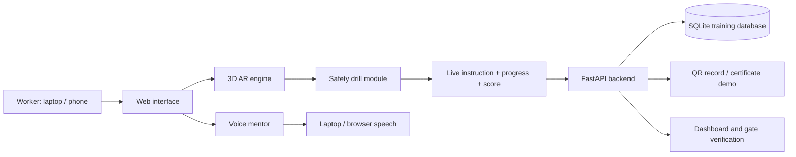

# खनन सुरक्षा साथी

## AR आधारित औद्योगिक सुरक्षा प्रशिक्षण प्लेटफॉर्म

**Problem Statement:** SIH-26041 — AR-Based Vocational Training Simulator for Industrial Safety in Jharkhand's Mining & Manufacturing Sector  
**Sector:** Mining, steel, manufacturing and contract-worker safety training  
**Built for:** Government of Jharkhand / DGMS-oriented vocational safety demonstration

---

## 1. यह प्रोजेक्ट क्या करता है?

**खनन सुरक्षा साथी** एक browser-based training application है। यह मोबाइल या लैपटॉप पर 3D और camera-overlay scenes के माध्यम से कामगारों को खदान की सुरक्षा सिखाता है।

सरल शब्दों में:

> पहले worker खतरा देखता है → फिर खुद सही safety action करता है → app तुरंत बताता है कि action सही है या गलत → अंत में score और training record बनता है।

इसका उद्देश्य किताब पढ़कर याद करने के बजाय **करके सीखना** है।

---

## 2. किस समस्या का समाधान है?

Jharkhand में नए mine और manufacturing workers को कई बार real mine में जाने से पहले safety practice का अवसर नहीं मिलता। गलत training से roof fall, methane, conveyor, dumper और fire जैसी घटनाओं का जोखिम बढ़ता है।

यह app उस gap को भरता है:

| पुराना तरीका | Khanan Suraksha Sathi में तरीका |
|---|---|
| Manual पढ़ो | 3D scene में खतरा देखो |
| Trainer सिर्फ समझाए | Worker खुद action करे |
| Drill के लिए plant रोकना पड़े | फोन या laptop पर practice |
| Paper certificate | QR-based training record demo |
| एक ही भाषा | Hindi, Santhali, Mundari, Bengali और English interface |

---

## 3. मुख्य फीचर्स

### A. पाँच interactive safety drills

| Drill | Worker क्या सीखता है? | AR/3D में क्या करता है? |
|---|---|---|
| **Roof Strata & Sounding** | छत की ढीली परत और roof-fall खतरा पहचानना | sounding points tap करता है, unsafe roof zone देखता है और roof bolt लगाता है |
| **Multi-Gas & Methane** | CH₄, CO और O₂ खतरे समझना | roof, breathing-height और floor zones sample करता है; power isolate और ventilation adjust करता है |
| **Conveyor LOTO** | चलती belt को सुरक्षित तरीके से बंद करना | switch off, hasp, personal padlock, danger tag और zero-energy test करता है |
| **100T Dumper Blind Spot** | heavy dumper के blind zone से बचना | red danger zone, green safe zone और horn code पहचानता है |
| **60-second SCSR Escape** | smoke/fire में self-rescuer पहनना | case खोलता है, mouthpiece, nose clip, goggles और oxygen starter को सही क्रम में operate करता है |

### B. Camera overlay + 3D sandbox

- **Camera overlay practice:** उपलब्ध camera feed पर training objects और instructions दिखते हैं।
- **3D sandbox:** camera उपलब्ध न हो तब भी पूरा drill चलता है।
- **Explore mode:** learner scene को drag करके अलग angles से देख सकता है।
- **Interactive objects:** केवल side button दबाने के बजाय training objects पर tap/drag actions रखे गए हैं।

### C. भाषा और आवाज़

- Visible language bar: Hindi, Santhali, Mundari, Bengali और English।
- हर training step के लिए **Listen Audio** action।
- Laptop voice service: Hindi और Bengali के लिए neural voice; Santhali/Mundari में visible regional text के साथ reliable Hindi safety narration fallback, ताकि laptop पर आवाज़ silent न रहे।

### D. Assessment और compliance demo

- step-by-step progress bar
- correct/incorrect action feedback
- drill score और reaction time
- worker training history
- QR record/certificate demo
- gate-inspector scanner workflow
- DGMS command-center style compliance dashboard

---

## 4. App को समझने का सबसे आसान तरीका

```text
Worker चुनें
    ↓
भाषा चुनें
    ↓
Safety drill चुनें
    ↓
3D / camera scene में खतरा देखें
    ↓
सही action करें
    ↓
App score और completion record बनाए
    ↓
Supervisor dashboard या QR record में result देखें
```

---

## 5. Data flow कैसे चलता है?



### इसका मतलब

1. Worker किसी drill में object tap या drag करता है।
2. संबंधित drill module check करता है कि action सही sequence में है या नहीं।
3. Screen पर next instruction, visual change, voice guidance और progress update होता है।
4. Drill पूरा होने पर app backend को score, time और hazards spotted भेजता है।
5. Backend SQLite database में record save करता है और dashboard/QR record के लिए data देता है।

---

## 6. टेक स्टैक — किस चीज़ के लिए क्या इस्तेमाल हुआ है?

| Technology | कहाँ इस्तेमाल हुआ है? | आसान भाषा में काम |
|---|---|---|
| **HTML5** | Screens और controls | App का ढांचा |
| **CSS3 + Tailwind CSS** | UI, responsive layout, animations | App को साफ़ और mobile-friendly बनाता है |
| **JavaScript** | Buttons, language, progress, logic | App को interactive बनाता है |
| **Three.js** | 3D mine scenes और equipment | Roof, conveyor, dumper, SCSR जैसे objects दिखाता है |
| **Web Camera API** | Camera overlay mode | Laptop/mobile camera permission लेकर live view देता है |
| **Web Speech API** | Browser voice और listening | Device की available voice से guidance देता है |
| **Edge TTS** | Laptop voice fallback | Windows में local regional voice न होने पर spoken guidance देता है |
| **FastAPI (Python)** | Backend APIs | Frontend और database के बीच सुरक्षित connection |
| **SQLite** | Worker, drill, certificate data | छोटा local database; अलग server की जरूरत नहीं |
| **Pydantic** | API input validation | गलत/अधूरा data आने से रोकता है |
| **qrcode + Pillow** | QR record generation | QR image बनाता है |
| **HTML5 QR Code** | Gate scanner | QR scan करके training status दिखाता है |
| **Service Worker + Web Manifest** | Repeat/offline shell | पहले load के बाद basic app resources cache करता है |

---

## 7. Project folder map

```text
mining-safety-partner/
│
├── backend/
│   ├── app.py              # APIs, QR, dashboard, voice endpoint
│   └── database.py         # SQLite tables and seed data
│
├── frontend/static/
│   ├── index.html          # Main application screen
│   ├── css/styles.css      # Look, layout and responsive styling
│   ├── js/app.js           # Main app controller
│   ├── js/ar-engine.js     # 3D scene, camera and interaction engine
│   ├── js/suraksha-sathi.js# Voice mentor logic
│   ├── js/modules/         # Five safety drills
│   ├── service-worker.js   # Offline caching shell
│   └── manifest.webmanifest# Installable web-app settings
│
├── start.py                # Starts the local application server
├── Run-Khanan-Suraksha-Sathi.bat  # One-click Windows launcher
├── requirements.txt        # Python dependencies
└── Project-Guide/README.md # This guide
```

---

## 8. App कैसे चलाएँ?

### Windows में सबसे आसान तरीका

1. Project folder खोलें।
2. **`Run-Khanan-Suraksha-Sathi.bat`** पर double-click करें।
3. Browser अपने आप खुलेगा।
4. `http://127.0.0.1:8000` address पर app चलाएँ।

### पहली बार setup

Python 3.10 या नया version install होना चाहिए। Terminal में project folder खोलकर चलाएँ:

```powershell
python -m pip install -r requirements.txt
python start.py
```

### बहुत ज़रूरी बात

`frontend/static/index.html` को सीधे double-click करके न खोलें। उस mode में database, QR, dashboard और laptop voice service काम नहीं करेंगे। हमेशा `http://127.0.0.1:8000` वाला app चलाएँ।

---

## 9. Demo देने का आसान क्रम

1. Header में worker और language bar दिखाएँ।
2. **Roof Strata** खोलें; sounding points और roof-bolt action दिखाएँ।
3. **Conveyor LOTO** में चलती belt, power isolation, padlock और danger tag दिखाएँ।
4. **Dumper** में blind zone और three-horn reverse warning दिखाएँ।
5. **SCSR drill** में mouthpiece, nose clip, goggles और oxygen action दिखाएँ।
6. एक drill complete करके score/record दिखाएँ।
7. Digital passport, QR scanner और DGMS command dashboard दिखाएँ।

---

## 10. Offline, camera और voice की सीमाएँ

- **Offline:** service worker basic app files cache करता है। Offline practice records browser में store हो सकते हैं; server database और certificate operations के लिए local server चाहिए।
- **Camera:** `localhost` पर camera permission काम करती है। दूसरे phone पर hosted app चलाने के लिए HTTPS जरूरी होता है।
- **AR:** यह camera feed के ऊपर 3D training overlay देता है। यह physical world surface-tracking या permanent real-world anchoring नहीं करता।
- **Voice:** laptop पर native Santhali/Mundari voice आम तौर पर installed नहीं होती, इसलिए app audio silent नहीं रहने देता और fallback narration चलाता है।
- **Safety:** यह training demonstrator है। इसे real mine induction, authorised SOP, competent supervisor या certified PPE की जगह इस्तेमाल नहीं करना चाहिए।

---

## 11. एक लाइन में प्रोजेक्ट का सार

> **Khanan Suraksha Sathi एक ऐसा AR safety training platform है जिसमें worker खदान के जोखिम को देखकर, छूकर और सही action करके सीखता है—उसकी training measurable रहती है और supervisor उसे verify कर सकता है।**

