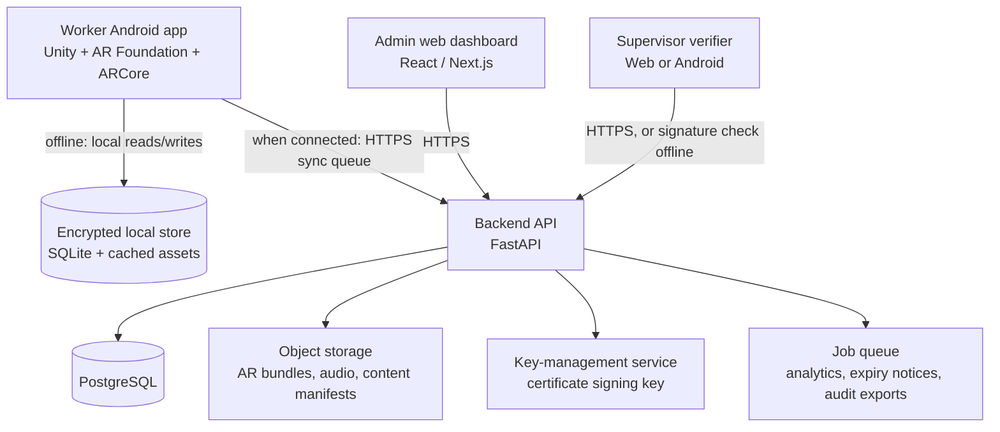
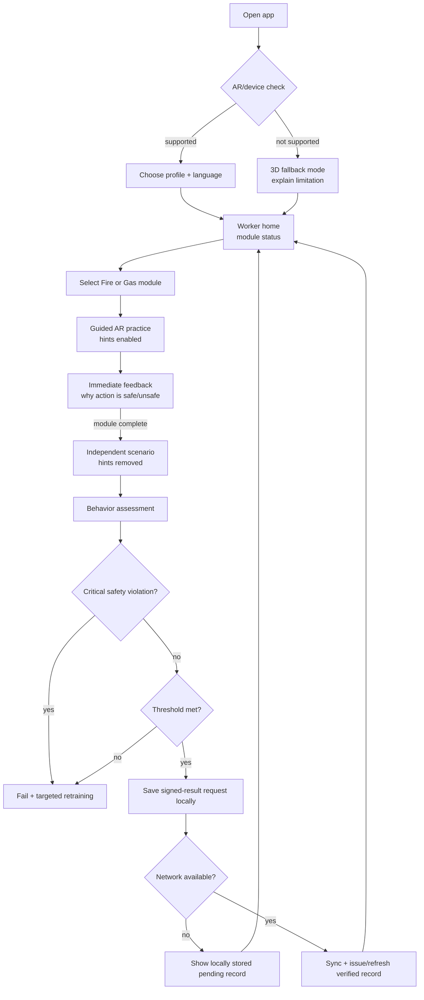
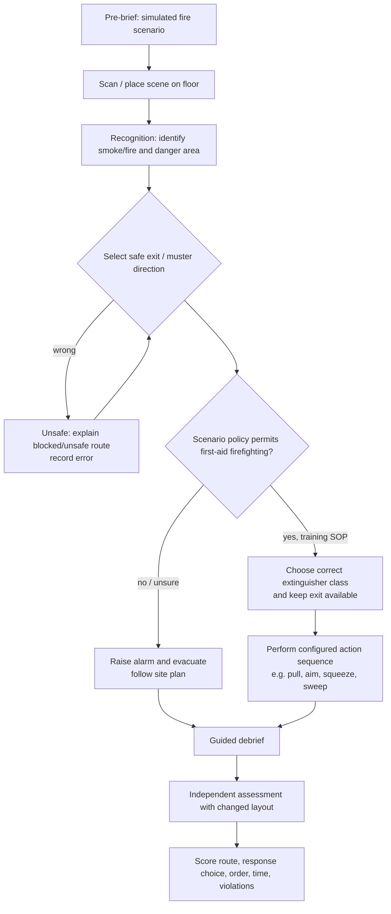
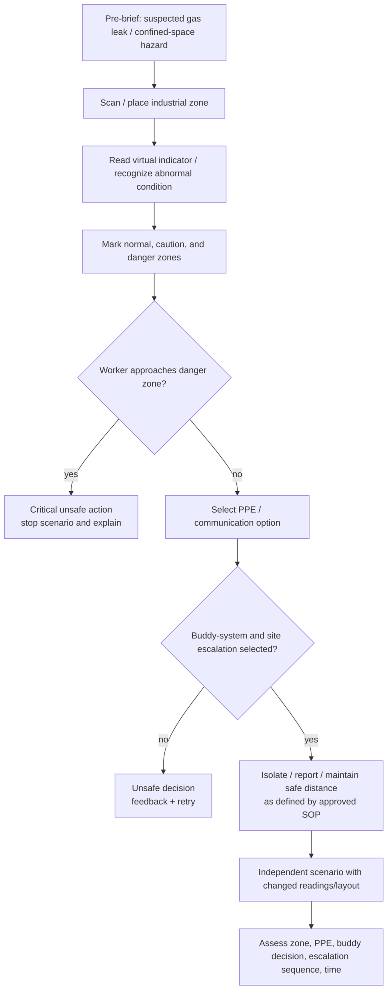

# SurakshaAR — SIH 26041 Implementation Blueprint

> **Purpose:** Turn SurakshaAR from a working web/mobile prototype into a defensible, offline-first AR competency-training platform for SIH 26041: *AR-Based Vocational Training Simulator for Industrial Safety in Jharkhand's Mining & Manufacturing Sector*.
>
> **Core promise:** workers safely rehearse hazardous situations, demonstrate correct decisions through actions rather than only MCQs, and receive a verifiable **training/competency record**. This is not a claim to issue a statutory DGMS certificate.

---

## 1. The problem we are solving

The problem is a **competency-verification pipeline**, not simply a 3D or camera feature.

```text
Worker → guided AR practice → independent scenario assessment
       → verified competency result → signed training record → QR verification
       → supervisor/admin compliance view
```

The key question is: **How can an employer see that a worker can recognize and respond to a hazard without exposing that worker to the real hazard?**

AR is useful here because the target skills are spatial and procedural:

- spotting a hazard area and a safe exit;
- choosing PPE and a safe response;
- performing actions in a safety-approved order;
- seeing feedback after an unsafe decision; and
- repeating the scenario until the behavior improves.

Do **not** claim that AR alone reduces accidents. The product should claim a measurable, narrower outcome: it records hazard-recognition accuracy, safe-action sequence, unsafe decisions, response time, and improvement on retake.

## 2. Scope decision for the SIH MVP

Publicly reproduced copies of the statement explicitly describe Fire & Explosion Response, Gas Leak & Confined Space Protocol, and begin `Machinery`, but the supplied description is truncated. Therefore, the contest build should complete the two fully specified modules rather than inventing domains four and five.

| Deliverable | MVP commitment | Why it matters |
| --- | --- | --- |
| Fire & Explosion Response | Complete guided training + independent assessment | Demonstrates exits, response sequence, and extinguisher interaction. |
| Gas Leak & Confined Space | Complete guided training + independent assessment | Demonstrates zone recognition, PPE, buddy-system, and stop/escalate behavior. |
| Machinery / LOTO | Short prototype or content-ready shell | Shows expandability without pretending it is complete. |
| Hindi and Santali | Reviewed text and audio packs | Inclusion is part of the learning design, not a UI toggle. |
| Offline operation | Training, assessment, result queue, and local record work with no network | Required for field conditions. |
| QR record + verifier | Cryptographically verifiable in production design | Makes the certificate meaningful rather than decorative. |
| Admin dashboard | Compliance, expiry, failure patterns, and content version | Turns the solution into a training-management system. |

## 3. Honest status of this repository

### What works now

This repository is a React + Vite + Capacitor Android project with a Three.js training simulator. It demonstrates a useful end-to-end contest flow:

```text
worker profile → language choice → guided scenario → action gating
→ unlocked assessment → local completion record → QR-style verification view → dashboard
```

It includes fire, gas, and machinery/LOTO scenario content; Hindi/Santali UI strings; browser/offline storage; camera permission flow; certificate rendering/PDF generation; QR rendering; a mock verifier; and a local admin dashboard.

### What it does not yet prove

- It is **not yet a true ARCore spatial application**: the current scene is browser-based 3D/camera presentation, without validated plane detection, anchors, and raycasting against a physical room.
- It has no production backend, authenticated organization tenancy, authoritative certificate registry, real cryptographic signing, or server-side revocation state.
- Its local workers, dashboard figures, and verification data are demonstration data.
- The Android project synchronizes, but an APK has not been built in this environment because the Android SDK/JDK are not installed.
- Training scripts are prototype content. A qualified safety professional and site SOP owner must validate every procedure before field use.

**Conclusion:** it is a strong functional prototype and a good presentation base, not yet a deployable industrial-safety or statutory-certification system.

## 4. Target architecture

The recommended production direction is a real Unity Android AR application for the worker experience, plus a separate web console. The current React/Capacitor app can remain the rapid-demo client while the AR module is migrated.



### Ownership boundaries

| Component | Must work offline? | Main responsibility |
| --- | --- | --- |
| Worker app | Yes | Run approved modules, assess behavior, save results, show local record. |
| Local store | Yes | Persist profile reference, content versions, attempts, outbox, and cached assets. |
| Sync service | No | Reconcile data, resolve duplicates, upload immutable assessment events. |
| Certificate service | Online issue; offline display/cryptographic validation possible | Sign, revoke, expire, and verify records. |
| Admin dashboard | No | Workforce compliance and aggregated learning analytics. |
| Content management | No | Publish versioned, expert-approved scenarios and language packs. |

### AR technology decision

| Layer | Recommended choice | Reason |
| --- | --- | --- |
| AR runtime | Unity 6 LTS + AR Foundation + ARCore Extensions | Native camera tracking, planes, anchors, raycasts, image tracking, and Android packaging. |
| Baseline placement | Plane detection + anchors + raycasts | Supported ARCore devices can place content stably on real floors/walls. |
| Enhanced realism | Depth/occlusion only when runtime check succeeds | Depth is not supported by every ARCore device and is disabled by default. |
| Low-capability fallback | Guided non-spatial 3D simulation | Avoids blocking training when a mid-range handset lacks ARCore/Depth. |
| Android storage | SQLite with platform encryption wrapper | Supports an offline-first result queue and content cache. |

ARCore requires supported devices; Android version alone is insufficient. Google documents that ARCore device support depends on camera, sensor, and performance certification, and that Depth support is device-specific. Use a compatibility test before a worker starts an AR module. [ARCore supported devices](https://developers.google.com/ar/devices?authuser=01) · [Depth API guidance](https://developers.google.com/ar/develop/depth)

## 5. Worker screen flow



### Screen inventory

1. **Device readiness:** camera permission, ARCore compatibility, free storage, language selection. Never silently fail into a blank camera screen.
2. **Worker identity:** organization-issued worker ID or pseudonymous worker code; avoid asking for Aadhaar unless an organization has a lawful, documented reason.
3. **Home / progress:** Fire, Gas, Machinery prototype; each shows `Not started`, `Practice`, `Assessment unlocked`, `Passed`, `Retake required`, or `Expired`.
4. **Safety pre-brief:** “This is a training simulation, not authorization to perform a hazardous task.” Include stop/exit rules and site-specific disclaimer.
5. **AR scan and calibration:** scan floor/scene, show a visual quality indicator, allow a safe fallback placement.
6. **Guided practice:** one objective at a time, local language text/audio, feedback after every decision.
7. **Independent assessment:** new layout/seed, no action hints, timer and violation recording.
8. **Outcome:** pass/fail plus competency breakdown and targeted retraining—not just a percentage.
9. **Training record:** status, completion date, scenario/content version, verifier QR; never label it as DGMS-issued unless formally authorized.
10. **Offline centre:** queued attempts, content-pack status, last sync, and a clear sync button.

## 6. AR Module 1 — Fire & Explosion Response

This must be built as a scenario, not a model viewer. Exact responses must be configured from the mine/factory SOP rather than presented as universal emergency doctrine.



### Events to record

| Competency | Event | Example evidence |
| --- | --- | --- |
| Hazard recognition | `hazard_marked` | Worker marks virtual fire zone correctly. |
| Spatial awareness | `safe_exit_selected` | Selected exit is not inside the expanding danger zone. |
| Decision making | `response_selected` | Alert/evacuate vs unsuitable extinguisher action. |
| Sequence | `task_completed` | Actions occurred in SOP-approved order. |
| Safety violation | `critical_violation` | Chose a blocked exit or entered an unsafe zone. |
| Timeliness | `safe_decision_time_ms` | Time from scenario start to first safe decision. |

## 7. AR Module 2 — Gas Leak & Confined Space

The learning objective is safe recognition and escalation. It must never imply that a passing worker is authorized to enter a confined space or conduct a rescue.



### Events to record

- gas/indicator reading viewed and interpreted;
- danger boundary selected;
- PPE choice and reason;
- buddy-system/communication decision;
- attempted unsafe entry or boundary crossing;
- escalation/isolation actions in the approved sequence;
- time to safe stop decision;
- number and kind of prompted retries.

## 8. Assessment model

### Score with critical failures

Do not award a certificate solely because a total percentage is high.

```text
Final result = PASS only when:
  total weighted score >= module threshold
  AND every mandatory task is complete
  AND critical_safety_violations = 0
  AND content / assessor policy permits certification
```

Example weights, configurable by module version:

| Dimension | Fire | Gas | Notes |
| --- | ---: | ---: | --- |
| Hazard/zone recognition | 25 | 30 | Correct spatial selection. |
| Response/PPE decision | 25 | 25 | Appropriate choice for the scenario. |
| Action sequence | 30 | 25 | Ordered tasks; SOP-version dependent. |
| Timeliness | 10 | 10 | Avoid a false sense of safety from slow correct answers. |
| Safe conduct | 10 | 10 | Deductions for non-critical unsafe behavior. |

Critical failures are configured by the safety reviewer. They could include entering a marked danger zone, taking a prohibited route, bypassing the required buddy-system choice, or selecting a response ruled unsafe by the approved scenario. A failure screen should show the exact unsafe behavior and send the worker to the relevant practice segment.

## 9. Content should be data-driven and versioned

Avoid a codebase structured around one hard-coded class per module. Instead, ship signed content packs.

```text
Module pack
 ├── module metadata and version
 ├── approved-language text and narration
 ├── 3D assets / addressable bundle references
 ├── scene placement rules
 ├── scenario seeds and hazards
 ├── tasks and expected action order
 ├── scoring and critical-failure rules
 └── content approval/audit metadata
```

### Safety-content release workflow

```text
Regulation / site SOP → safety expert review → instructional design
→ AR scenario and assessment rules → language review → field test
→ approval → signed/versioned release → monitored feedback → revision
```

The Directorate General of Mines Safety continues to host the **Mines Vocational Training Rules, 1966**, which include a training-centre, practical-training, progress-assessment, and certification structure. It is useful as a training-workflow reference, but legal applicability and current requirements must be checked with the relevant authority/site compliance team. [DGMS rules PDF](https://www.dgms.gov.in/writereaddata/UploadFile/MineVocational966.pdf) · [DGMS legislation archive](https://dgms.gov.in/UserView/index?mid=1335)

## 10. Backend data model (PostgreSQL)

The following is a practical starting schema. Use UUID primary keys, `timestamptz`, an immutable event log, and organization tenancy on every employer-owned record.

```sql
create table organizations (
  id uuid primary key,
  name text not null,
  status text not null check (status in ('active','suspended')),
  created_at timestamptz not null default now()
);

create table sites (
  id uuid primary key,
  organization_id uuid not null references organizations(id),
  name text not null,
  sector text not null check (sector in ('mining','steel','mica','manufacturing','other')),
  state_code text not null default 'JH',
  created_at timestamptz not null default now()
);

create table users (
  id uuid primary key,
  organization_id uuid not null references organizations(id),
  role text not null check (role in ('worker','trainer','supervisor','site_admin','org_admin','auditor')),
  worker_code text,
  display_name text,
  preferred_language text not null default 'hi',
  status text not null check (status in ('active','inactive')),
  created_at timestamptz not null default now(),
  unique (organization_id, worker_code)
);

create table modules (
  id uuid primary key,
  code text unique not null, -- fire-response, gas-confined-space
  title text not null,
  status text not null check (status in ('draft','published','retired'))
);

create table module_versions (
  id uuid primary key,
  module_id uuid not null references modules(id),
  version text not null,
  manifest_sha256 text not null,
  approved_by_user_id uuid references users(id),
  approved_at timestamptz,
  effective_from timestamptz,
  retired_at timestamptz,
  unique (module_id, version)
);

create table scenarios (
  id uuid primary key,
  module_version_id uuid not null references module_versions(id),
  scenario_key text not null,
  seed_config jsonb not null,
  scoring_config jsonb not null,
  critical_failure_config jsonb not null,
  unique (module_version_id, scenario_key)
);

create table training_sessions (
  id uuid primary key,
  organization_id uuid not null references organizations(id),
  site_id uuid references sites(id),
  worker_id uuid not null references users(id),
  module_version_id uuid not null references module_versions(id),
  scenario_id uuid references scenarios(id),
  mode text not null check (mode in ('guided','assessment','fallback_3d')),
  device_install_id uuid not null,
  started_at timestamptz not null,
  completed_at timestamptz,
  sync_state text not null check (sync_state in ('pending','synced','conflict')),
  client_event_hash text not null
);

create table assessment_events (
  id uuid primary key,
  training_session_id uuid not null references training_sessions(id),
  sequence_no integer not null,
  event_type text not null,
  payload jsonb not null,
  occurred_at timestamptz not null,
  client_hash text not null,
  unique (training_session_id, sequence_no)
);

create table assessment_results (
  id uuid primary key,
  training_session_id uuid unique not null references training_sessions(id),
  score numeric(5,2) not null,
  passed boolean not null,
  critical_violation_count integer not null default 0,
  competency_breakdown jsonb not null,
  assessed_at timestamptz not null,
  reviewed_by_user_id uuid references users(id)
);

create table certificates (
  id uuid primary key,
  public_credential_id text unique not null,
  organization_id uuid not null references organizations(id),
  worker_id uuid not null references users(id),
  assessment_result_id uuid unique not null references assessment_results(id),
  issued_at timestamptz not null,
  expires_at timestamptz,
  status text not null check (status in ('valid','expired','revoked','superseded')),
  signing_key_id text not null,
  canonical_payload jsonb not null,
  signature_base64 text not null
);

create table certificate_revocations (
  id uuid primary key,
  certificate_id uuid unique not null references certificates(id),
  reason_code text not null,
  revoked_by_user_id uuid references users(id),
  revoked_at timestamptz not null default now()
);

create table audit_log (
  id uuid primary key,
  organization_id uuid references organizations(id),
  actor_user_id uuid references users(id),
  action text not null,
  entity_type text not null,
  entity_id uuid not null,
  metadata jsonb not null default '{}',
  occurred_at timestamptz not null default now()
);
```

### Minimum indexes and controls

- Index `training_sessions(worker_id, completed_at desc)`, `assessment_events(training_session_id, sequence_no)`, `certificates(public_credential_id)`, and `certificates(organization_id, status, expires_at)`.
- Enforce organization scoping through row-level security or a strict service-layer tenant filter.
- Store only the minimum personal data required for the institution’s training purpose.
- Encrypt in transit (TLS) and at rest; do not put credentials, tokens, worker names, or personal IDs inside logs.
- Preserve certificate and assessment audit events; append corrective records instead of silently overwriting history.

## 11. Offline mobile schema and synchronization

The device is authoritative only for **capturing a signed client event chain while offline**; the server is authoritative for workforce records, revocation, and issued credentials.

```text
local_profile
content_pack(module_version, manifest_hash, assets_ready, expires_at)
scenario_cache(scenario_key, encrypted_payload)
session_draft(session_id, started_at, mode, module_version)
event_outbox(event_id, session_id, sequence_no, payload, client_hash, state)
local_result(result_id, session_id, score, pass, pending_sync)
local_credential(credential_id, signed_payload, signature, last_verified_at)
sync_cursor(last_server_sequence, last_success_at)
```

Synchronization rules:

1. Every attempt gets a client-generated UUID and monotonically increasing event sequence.
2. Upload is idempotent: retrying the same event cannot create a second attempt.
3. A published module version is immutable. A new SOP produces a new version; attempts retain the version that trained the worker.
4. The app immediately shows `pending verification` when offline. It must not falsely show a server-issued credential before server issuance.
5. If a server finds a conflict or missing events, it marks the attempt for review rather than rewriting the evidence.
6. Only downloaded, integrity-checked content packs may run offline.

## 12. Certificate and QR design

### What the QR proves

A QR code image alone proves nothing. In the target design, the QR represents a signed credential and points to a controlled verifier.

```text
certificate issuance
  approved pass result
    → canonical, minimal credential payload
    → Ed25519 digital signature using issuer private key
    → QR contains credential reference + version + signature envelope
    → online verifier checks signature, issuer, validity, expiry, revocation
```

Suggested canonical payload (do **not** include Aadhaar, phone number, DOB, or other unnecessary personal data):

```json
{
  "v": 1,
  "credential_id": "SARK-2026-7D6K8M2Q",
  "issuer": "surakshaar-demo-org",
  "worker_ref": "pseudonymous-worker-reference",
  "module_versions": ["fire-response@1.0.0", "gas-confined-space@1.0.0"],
  "issued_at": "2026-09-27T10:00:00Z",
  "expires_at": "2027-09-27T10:00:00Z",
  "result_hash": "sha256-of-approved-result-summary"
}
```

Verifier result states: `VALID`, `EXPIRED`, `REVOKED`, `NOT_FOUND`, `INVALID_SIGNATURE`, `OFFLINE_STATUS_UNKNOWN`.

An offline verifier can validate the Ed25519 signature with a bundled issuer public key. It cannot reliably know revocation after its last sync, so it must state the last status-check time instead of pretending that revocation is current.

### Regulatory wording

Use **Digital Training Completion Record** or **Competency Record**. Do not say “DGMS certificate”, “government-issued certificate”, or “statutory certification” unless an authorized issuer has formally adopted the service and legal conditions are met. The Occupational Safety, Health and Working Conditions Code, 2020 itself provides that it comes into force on dates notified by the Central Government; the precise currently applicable statutory position should be validated from the official Gazette and with the deploying organization’s compliance team, not guessed from a contest brief. [Official Code text](https://labour.gov.in/sites/default/files/OSH_Gazette.pdf)

## 13. API surface

| Method | Endpoint | Purpose |
| --- | --- | --- |
| `POST` | `/v1/auth/device-session` | Bind/re-authenticate a managed device without embedding secrets in the app. |
| `GET` | `/v1/content/manifest` | Download only the worker’s approved language/module pack manifest. |
| `GET` | `/v1/content/packs/{version}` | Download signed assets and scenario definitions. |
| `POST` | `/v1/sync/batches` | Idempotently upload training sessions and immutable events. |
| `GET` | `/v1/workers/me/progress` | Retrieve progress/expiry state after connectivity returns. |
| `POST` | `/v1/credentials/issue` | Server-side issuance after a valid result and policy checks. |
| `GET` | `/v1/verify/{credentialId}` | Return public minimum verifier status. |
| `POST` | `/v1/credentials/{id}/revoke` | Authorized revocation with an audit reason. |
| `GET` | `/v1/admin/compliance` | Aggregated authorized dashboard metrics. |
| `POST` | `/v1/admin/content-versions/{id}/approve` | Four-eyes approval for safety content release. |

Use short-lived access tokens, role/tenant authorization, request idempotency keys for sync/issue calls, and rate limits on the public verifier. The verifier must return only the minimum evidence necessary (credential status, module name, issue/expiry, and carefully controlled worker display data).

## 14. Admin compliance dashboard

The dashboard should answer operational questions—not merely count users.

| Card / view | Decision it supports |
| --- | --- |
| Workforce completion by site, department, contractor | Who still needs training? |
| Pending / failed / expired credentials | Who cannot be scheduled until training is completed or renewed? |
| Module and language performance | Is a module or translation causing misunderstanding? |
| Critical-violation heat map | Which unsafe decision needs retraining or SOP clarification? |
| Assessment trend after retraining | Is practice improving safe responses? |
| Content-version coverage | Which workers trained on an old rule/SOP version? |
| Verifier and revocation audit | Who checked, revoked, or reissued records? |

Example useful insight: “At Site A, 21% of workers choose the wrong evacuation route during the fire assessment.” That is a training intervention signal, not an accident-risk prediction.

## 15. Localisation and accessibility

- Keep English source content separate from Hindi and Santali translation packs.
- Support Santali Ol Chiki where the stakeholder chooses it; obtain native-speaker review before release.
- Pair short on-screen instructions with reviewed audio narration and clear icons.
- Never use unreviewed machine translation as safety content.
- Avoid color-only hazard signals; add icons, labels, sound, and vibration where appropriate.
- Provide low-literacy-friendly micro-instructions, replay controls, and paced voice guidance.
- Store chosen language offline with the module assets.

## 16. Five-minute SIH demo script

| Time | Presenter action | Judge takeaway |
| ---: | --- | --- |
| 0:00–0:25 | State the challenge: attendance does not prove a worker can act safely. | This solves competency verification, not generic e-learning. |
| 0:25–0:40 | Select worker and Hindi/Santali. | Local-language, phone-first accessibility. |
| 0:40–1:25 | Launch Fire module, scan/place the scenario, identify hazard and safe exit. | Genuine spatial rehearsal, not a PDF. |
| 1:25–1:45 | Deliberately choose an unsafe route/action. Show immediate correction and recorded violation. | Behavior is measured; mistakes are safe learning moments. |
| 1:45–2:15 | Complete the approved response sequence. | Procedures are practiced in order. |
| 2:15–2:45 | Start independent assessment with hints removed and a changed scenario. | Assessment tests competence rather than memory of UI hints. |
| 2:45–3:10 | Show result breakdown and pass criteria; mention critical violations override score. | Strong assessment design. |
| 3:10–3:35 | Turn network off; open Gas module and complete/save an attempt. | Offline-first is real. |
| 3:35–4:00 | Restore connection and show queued result syncing. | Field data becomes compliant, auditable records. |
| 4:00–4:25 | Show QR record and verifier `VALID` status; explain signature/revocation design. | QR is designed for authenticity, not decoration. |
| 4:25–4:50 | Open admin dashboard; filter a site and show failure-pattern insight / expiring records. | Employers gain compliance intelligence. |
| 4:50–5:00 | Close: “Safe rehearsal, assessed behavior, verifiable records—on the phones workers already have.” | Clear value proposition. |

## 17. Delivery roadmap

| Phase | Outcome | Exit criteria |
| --- | --- | --- |
| 1. Contest hardening | Reliable prototype demo | Fire + Gas fully playable, assessment gate, offline demonstration, clear no-statutory-certificate wording. |
| 2. True AR MVP | Real room placement | ARCore compatibility test, plane/raycast/anchor placement, fallback 3D mode, target-device testing. |
| 3. Trusted records | Backend + signature registry | Authenticated sync, immutable events, Ed25519 credentials, verifier, admin tenancy, audit logs. |
| 4. Content validation pilot | Site-safe trial | Safety officer approval, translated-content review, supervised pilot, usability and learning metrics. |
| 5. Deployment readiness | Controlled institutional rollout | Threat model, privacy review, backup/incident process, certificate governance, support plan. |

## 18. Acceptance tests

### Worker app

- On a supported Android device, the app identifies a plane, anchors the scenario, and maintains stable content when the camera moves.
- On an unsupported device, the app explicitly offers the fallback and never claims spatial AR is active.
- With Wi-Fi and cellular data disabled, a cached Fire/Gas module launches, an assessment completes, and evidence enters the local outbox.
- Reconnecting uploads the attempt once, even if the user retries the sync button.
- A critical violation fails an assessment even when the numeric score would otherwise pass.
- Hindi and Santali text/audio remain available offline and are reviewed by the project’s named language reviewers.

### Credential and dashboard

- A valid credential verifies as `VALID`; a modified signed payload is `INVALID_SIGNATURE`.
- A revoked credential is `REVOKED` online.
- Offline verification shows signature validity and clearly shows when revocation status was last checked.
- A site admin can see only their organization/site data; they cannot retrieve another tenant’s worker records.
- Dashboard statistics reconcile with the immutable assessment-result data.

## 19. Judge-ready answers

**Why AR instead of video?**  The skills include spatial hazard recognition and procedural sequence. Workers perform decisions in a safe simulated environment rather than only watching them.

**Why not VR?**  The stated target is mid-range Android phones without an external headset. AR removes the headset/accessibility barrier while preserving physical-context learning.

**What if internet is unavailable?**  Training, assessment, local result storage, and pending records work offline. Synchronization, authoritative certificate issuance, and live revocation status resume later.

**Can a QR code be forged?**  A plain QR could be. The target record uses a canonical signed payload, an issuer key, a verifier service, expiry, revocation, and audit history.

**Is it a DGMS statutory certificate?**  No. It is a verifiable digital training/competency record until a competent authority formally recognizes or integrates it into a statutory process.

**How do you prevent unsafe content?**  Every scenario is SOP/regulation-derived, expert-reviewed, language-reviewed, versioned, approved, and auditable.

## 20. Final positioning

> **SurakshaAR is an offline-first mobile competency platform for Jharkhand’s industrial workforce. It lets workers safely rehearse hazardous scenarios in AR, measures their decisions through action-based assessment, and gives employers verifiable training records and compliance insight.**

That is the strongest defensible form of the project: focused, technically credible, honest about legal boundaries, and directly aligned with the stated problem.
